# Tài liệu luồng xử lý sự kiện và tương tác API - VanHieuPC

> Mục tiêu: giúp nắm rõ các luồng hoạt động chính của website thương mại điện tử để trình bày/bảo vệ đồ án.

## 1. Tổng quan kiến trúc

Dự án dùng mô hình **Next.js App Router**:

- **Client/UI**: các trang cửa hàng, chi tiết sản phẩm, giỏ hàng, thanh toán, tài khoản, chatbot, admin.
- **API Routes**: nằm trong `src/app/api/...`, nhận request từ UI và trả JSON hoặc redirect.
- **Database MySQL**: lưu users, sessions, products, variants, carts, orders, coupons, reviews...
- **Dịch vụ ngoài**:
  - **VNPay**: xử lý thanh toán online.
  - **Cloudinary/upload**: lưu ảnh sản phẩm ở phần admin.
  - **LLM/AI fallback**: hỗ trợ chatbot khi rule/tool không có dữ liệu phù hợp.

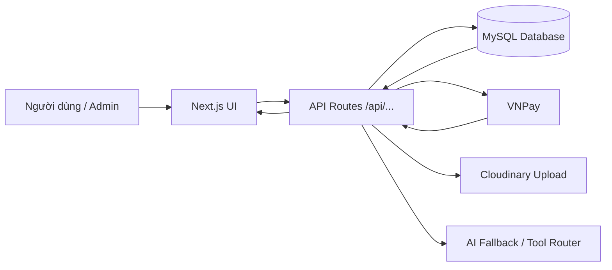

---

## 2. Nhóm API chính

| Nhóm | Endpoint tiêu biểu | Vai trò |
|---|---|---|
| Auth | `/api/auth/login`, `/api/auth/register`, `/api/auth/logout` | Đăng nhập, đăng ký, đăng xuất, tạo/xóa session cookie |
| User | `/api/me`, `/api/me/orders`, `/api/me/addresses`, `/api/me/wishlist` | Lấy/cập nhật thông tin cá nhân, đơn hàng, địa chỉ, yêu thích |
| Products | `/api/products`, `/api/products/[slug]`, `/api/products/filters` | Hiển thị danh sách, chi tiết, bộ lọc sản phẩm |
| Cart | `/api/cart`, `/api/cart/item` | Lấy giỏ hàng, thêm sản phẩm, cập nhật/xóa item |
| Checkout | `/api/checkout`, `/api/checkout/apply-coupon` | Tạo đơn hàng, áp mã giảm giá |
| Payment | `/api/payment/vnpay-return` | Nhận kết quả trả về từ VNPay |
| Chatbot | `/api/chatbot` | Lấy lịch sử chat, gửi tin nhắn và nhận phản hồi |
| Admin | `/api/admin/products`, `/api/admin/orders`, `/api/admin/users`, ... | Quản trị sản phẩm, đơn hàng, user, coupon, setting, upload |

---

## 3. Luồng xác thực đăng nhập

### API liên quan

- `POST /api/auth/login`
- `POST /api/auth/register`
- `POST /api/auth/logout`
- `GET /api/me`
- `PATCH /api/me`
- `middleware.ts` bảo vệ route `/admin/:path*`

### Diễn giải luồng đăng nhập

1. Người dùng nhập email và mật khẩu.
2. UI gửi request đến `POST /api/auth/login`.
3. API kiểm tra email/password có rỗng không.
4. API truy vấn bảng `users` theo email.
5. Nếu user không tồn tại hoặc mật khẩu sai, trả lỗi `401`.
6. Nếu tài khoản bị khóa, trả lỗi `403`.
7. Nếu hợp lệ, API tạo session trong database và set cookie `session_token`.
8. UI nhận thông tin user và chuyển trạng thái sang đã đăng nhập.

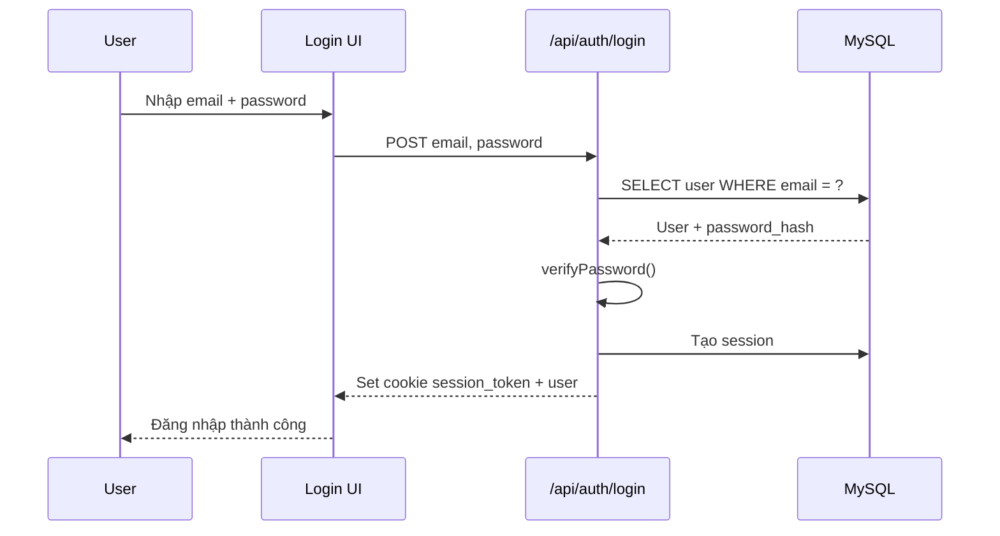

### Luồng bảo vệ admin

1. Khi truy cập `/admin/...`, middleware chạy trước.
2. Middleware kiểm tra cookie `session_token`.
3. Nếu không có cookie, chuyển về `/admin/login?next=...`.
4. Nếu có cookie, cho phép đi tiếp.

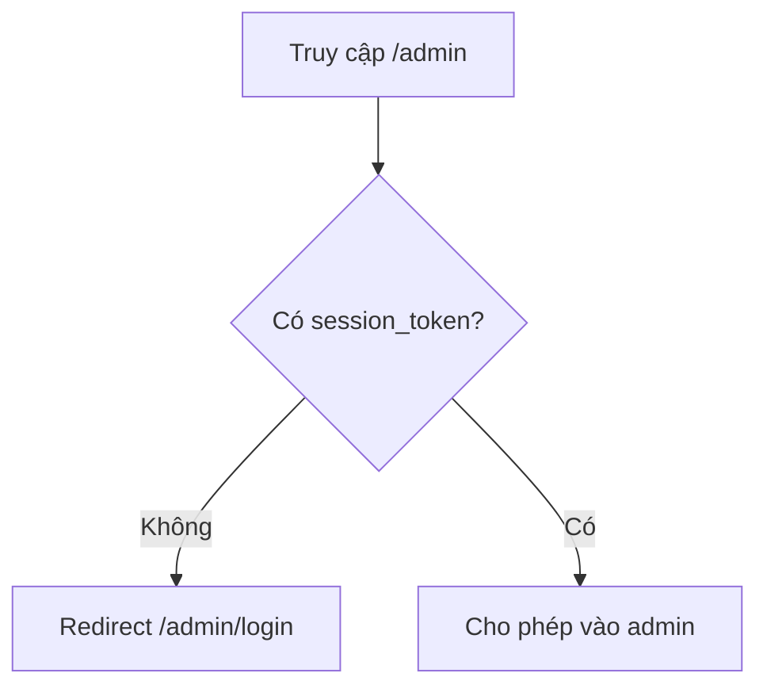

> Lưu ý khi bảo vệ đồ án: session nằm ở cookie phía server, không còn phụ thuộc localStorage nên an toàn hơn so với lưu user id ở client.

---

## 4. Luồng xem sản phẩm và lọc sản phẩm

### API liên quan

- `GET /api/products`
- `GET /api/products/[slug]`
- `GET /api/products/filters`
- `GET /api/products/[slug]/reviews`

### Luồng danh sách sản phẩm

1. Người dùng vào trang cửa hàng hoặc đổi bộ lọc.
2. UI đọc query trên URL như category, brand, price, sort, view mode...
3. UI gọi `GET /api/products` kèm query.
4. API truy vấn bảng `products`, join category/brand nếu cần.
5. API trả danh sách sản phẩm đã chuẩn hóa giá, ảnh, trạng thái.
6. UI render dạng grid/list.

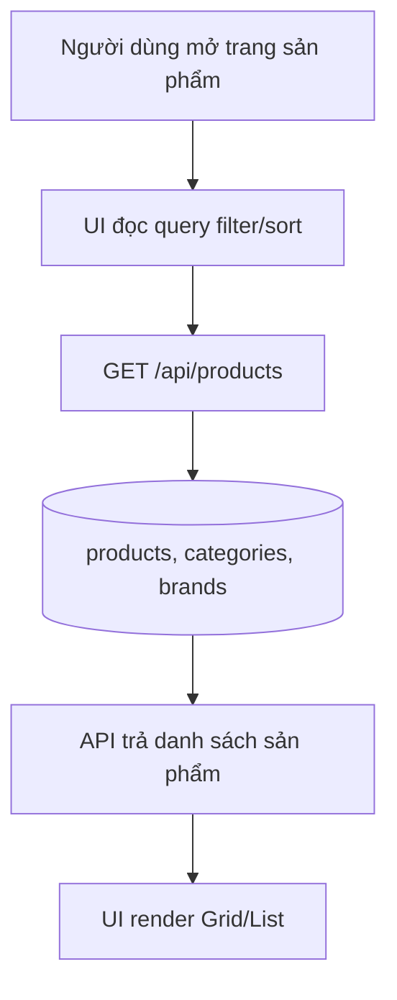

### Luồng chi tiết sản phẩm

1. Người dùng click một sản phẩm.
2. UI vào route `/products/[slug]`.
3. API `GET /api/products/[slug]` lấy sản phẩm theo slug.
4. API lấy thêm variants, images, brand/category.
5. UI hiển thị gallery ảnh, thông số, biến thể, giá và nút thêm giỏ hàng.

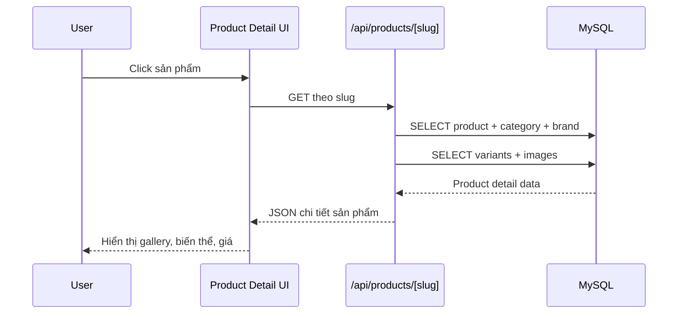

---

## 5. Luồng giỏ hàng

### API liên quan

- `GET /api/cart`
- `POST /api/cart`
- `PATCH /api/cart/item`
- `DELETE /api/cart/item`

### Thêm sản phẩm vào giỏ

1. Người dùng chọn sản phẩm, biến thể, số lượng.
2. UI gọi `POST /api/cart` với `product_id`, `variant_id`, `quantity`.
3. API yêu cầu user đã đăng nhập qua session.
4. API kiểm tra sản phẩm có tồn tại và còn active không.
5. Nếu có biến thể, kiểm tra biến thể thuộc đúng sản phẩm và còn active.
6. API tìm hoặc tạo cart của user.
7. Nếu item đã có trong giỏ, cộng dồn số lượng nhưng không vượt tồn kho.
8. Nếu chưa có, insert item mới vào `cart_items`.
9. API trả `{ success, id, quantity }`.

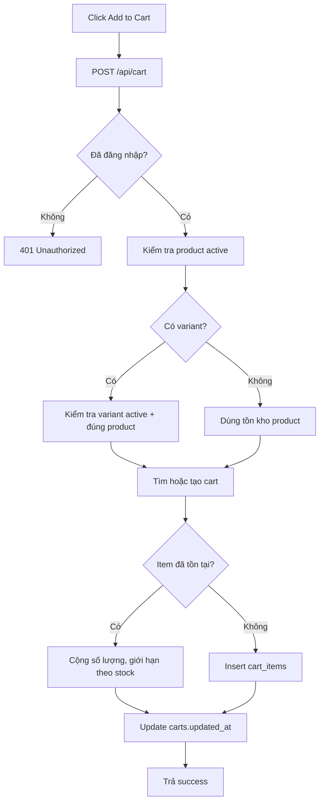

### Lấy giỏ hàng

1. UI gọi `GET /api/cart`.
2. API lấy user từ session.
3. API join `cart_items`, `carts`, `products`, `product_variants`.
4. API tính trạng thái `in_stock`.
5. UI hiển thị danh sách item và tổng tiền tạm tính.

---

## 6. Luồng checkout và tạo đơn hàng

### API liên quan

- `POST /api/checkout`
- `POST /api/checkout/apply-coupon`
- `GET /api/payment/vnpay-return`

### Các hình thức checkout hiện có

| Checkout option | Ý nghĩa | Payment method | Shipping fee |
|---|---|---|---|
| `pickup_store` | Nhận tại cửa hàng, trả tại cửa hàng | `PAY_AT_STORE` | 0 |
| `pickup_online` | Nhận tại cửa hàng, thanh toán online | `VNPAY` | 0 |
| `delivery_online` | Giao tận nơi, thanh toán online | `VNPAY` | 30.000 |

### Luồng tạo đơn hàng

1. Người dùng nhập thông tin liên hệ/giao hàng.
2. UI gọi `POST /api/checkout`.
3. API xác định `checkout_option`, `payment_method`, `shipping_fee`.
4. API validate thông tin liên hệ: email, họ tên, số điện thoại.
5. Nếu giao tận nơi, validate thêm địa chỉ, tỉnh/thành, quận/huyện, phường/xã.
6. Nếu user đã đăng nhập, API lấy item từ giỏ hàng trong database.
7. Nếu khách chưa đăng nhập, API lấy item từ body request.
8. API kiểm tra từng sản phẩm/biến thể còn active và đủ tồn kho.
9. API tính `subtotal`, `VAT 10%`, `discount`, `shipping_fee`, `total`.
10. Nếu có coupon, API kiểm tra còn active, chưa hết hạn, chưa hết lượt.
11. API mở transaction.
12. Insert bảng `orders`.
13. Insert các dòng vào `order_items`.
14. Nếu có coupon, tăng `used_count`.
15. Nếu user có cart, xóa `cart_items` sau khi đặt hàng.
16. Commit transaction.
17. Nếu thanh toán VNPay, tạo `paymentUrl` và trả về UI.
18. Nếu trả tại cửa hàng, trả đơn hàng thành công ngay với payment pending.

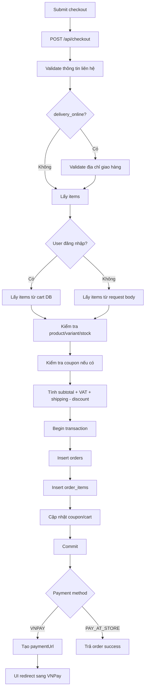

---

## 7. Luồng thanh toán VNPay trả về

### API liên quan

- `GET /api/payment/vnpay-return`

### Diễn giải

1. Sau khi người dùng thanh toán ở VNPay, VNPay redirect về endpoint return.
2. API đọc query params, đặc biệt `vnp_TxnRef`, `vnp_Amount`, `vnp_ResponseCode`, chữ ký.
3. API verify chữ ký để chống giả mạo.
4. Nếu chữ ký sai, redirect `/payment/failed?reason=invalid-signature`.
5. API tìm đơn hàng theo `order_number`.
6. Nếu không tìm thấy, redirect failed.
7. Nếu đơn không phải thanh toán VNPay, redirect failed.
8. API kiểm tra response code và transaction status.
9. Nếu thanh toán thất bại, cập nhật `payment_status = FAILED`, giữ `status = PENDING`.
10. Nếu thành công, kiểm tra số tiền trả về có khớp tổng đơn không.
11. Nếu đúng, cập nhật `payment_status = PAID`, `status = CONFIRMED`.
12. Redirect sang `/payment/success`.

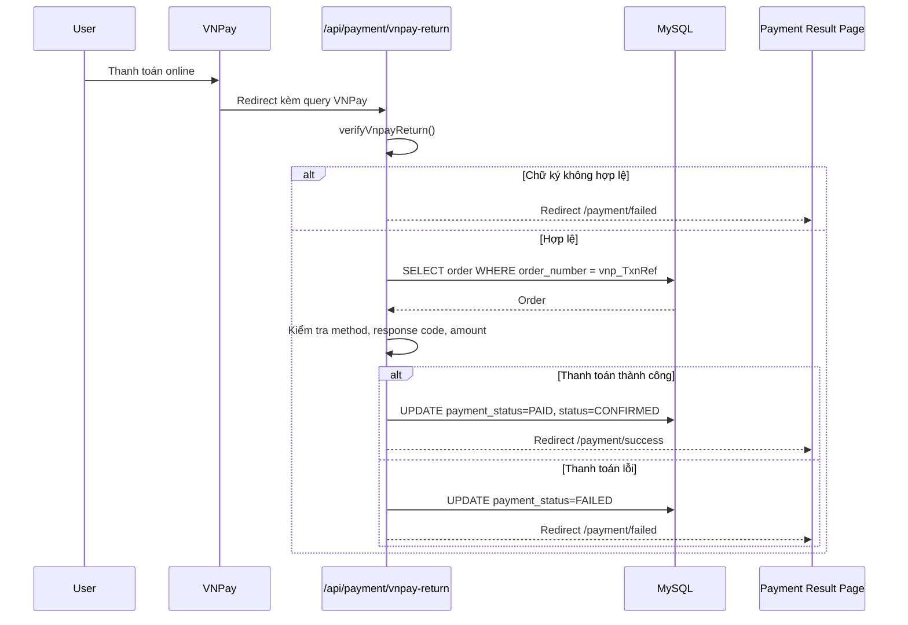

---

## 8. Luồng quản lý đơn hàng phía admin

### API liên quan

- `GET /api/admin/orders`
- `GET /api/admin/orders/[id]`
- `PATCH /api/admin/orders/[id]`

### Diễn giải

1. Admin vào trang quản lý đơn hàng.
2. Middleware kiểm tra cookie session trước khi vào `/admin`.
3. UI gọi API lấy danh sách hoặc chi tiết đơn hàng.
4. API join `orders`, `users`, `coupons`, `order_items`, `products`, `product_variants`.
5. Admin cập nhật trạng thái đơn hoặc trạng thái thanh toán.
6. UI gọi `PATCH /api/admin/orders/[id]`.
7. API update `status` và/hoặc `payment_status`.
8. API trả lại order đã cập nhật.

```mermaid
flowchart TD
  A[Admin mở quản lý đơn] --> B[Middleware kiểm tra session]
  B --> C{Có session?}
  C -- Không --> D[Redirect admin login]
  C -- Có --> E[GET /api/admin/orders hoặc /[id]]
  E --> F[(orders + users + coupons + items)]
  F --> G[UI hiển thị đơn]
  G --> H[Admin đổi trạng thái]
  H --> I[PATCH /api/admin/orders/[id]]
  I --> J[UPDATE orders]
  J --> K[Trả order mới]
```

---

## 9. Luồng quản lý sản phẩm phía admin

### API liên quan

- `GET /api/admin/products`
- `POST /api/admin/products`
- `GET /api/admin/products/[id]`
- `PUT /api/admin/products/[id]`
- `DELETE /api/admin/products/[id]`
- `POST /api/admin/upload`

### Luồng sửa sản phẩm

1. Admin mở form sửa sản phẩm.
2. UI gọi `GET /api/admin/products/[id]`.
3. API lấy product, category, brand, images, variants.
4. UI render form chỉnh sửa.
5. Admin cập nhật thông tin, ảnh, giá, tồn kho, trạng thái.
6. UI gọi `PUT /api/admin/products/[id]`.
7. API chuẩn hóa danh sách ảnh `general_images`.
8. Nếu không có `thumbnail_url`, API dùng ảnh đầu tiên làm thumbnail.
9. API update bảng `products`.
10. API xóa ảnh general cũ trong `product_images` với `variant_id IS NULL`.
11. API insert lại danh sách ảnh general mới.
12. API trả product đã cập nhật.

```mermaid
flowchart TD
  A[Admin mở form sửa sản phẩm] --> B[GET /api/admin/products/[id]]
  B --> C[(products + categories + brands)]
  B --> D[(product_images + product_variants)]
  C --> E[UI hiển thị form]
  D --> E
  E --> F[Admin lưu thay đổi]
  F --> G[PUT /api/admin/products/[id]]
  G --> H[Chuẩn hóa thumbnail/images/specs]
  H --> I[UPDATE products]
  I --> J[DELETE general product_images cũ]
  J --> K[INSERT general product_images mới]
  K --> L[Trả product updated]
```

### Luồng xóa sản phẩm

1. Admin bấm xóa.
2. UI gọi `DELETE /api/admin/products/[id]`.
3. API xóa dòng trong bảng `products`.
4. API trả `{ success: true }`.

---

## 10. Luồng wishlist và địa chỉ người dùng

### Wishlist

API:

- `GET /api/me/wishlist`
- `POST /api/me/wishlist`
- `DELETE /api/me/wishlist`

Luồng:

1. Người dùng bấm icon yêu thích ở sản phẩm.
2. UI gọi `POST /api/me/wishlist` với product id.
3. API lấy user từ session.
4. API insert vào bảng wishlist nếu hợp lệ.
5. Khi bỏ yêu thích, UI gọi `DELETE /api/me/wishlist`.

### Địa chỉ

API:

- `GET /api/me/addresses`
- `POST /api/me/addresses`
- `PATCH /api/me/addresses/[id]`
- `DELETE /api/me/addresses/[id]`

Luồng:

1. Người dùng vào trang tài khoản/địa chỉ.
2. UI gọi `GET` để lấy danh sách địa chỉ.
3. Khi thêm/sửa/xóa, UI gọi endpoint tương ứng.
4. API luôn lấy user từ session để tránh sửa dữ liệu của người khác.

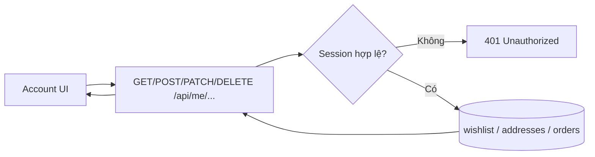

---

## 11. Luồng đánh giá sản phẩm

### API liên quan

- `GET /api/products/[slug]/reviews`
- `POST /api/products/[slug]/reviews`
- `POST /api/me/orders/[id]/reviews`

### Diễn giải

1. Ở trang chi tiết sản phẩm, UI gọi API lấy danh sách review theo slug.
2. Người dùng chỉ nên đánh giá sau khi có đơn hàng phù hợp.
3. Khi gửi review từ đơn hàng, UI gọi endpoint trong `/api/me/orders/[id]/reviews`.
4. API kiểm tra user qua session, kiểm tra đơn hàng thuộc user và sản phẩm nằm trong đơn.
5. API lưu review, cập nhật điểm đánh giá nếu có logic liên quan.

```mermaid
flowchart TD
  A[Người dùng xem product detail] --> B[GET reviews theo slug]
  B --> C[(reviews + users)]
  C --> D[UI hiển thị reviews]
  E[Người dùng gửi đánh giá từ đơn hàng] --> F[POST /api/me/orders/[id]/reviews]
  F --> G{Session + order thuộc user?}
  G -- Không --> H[401/403/404]
  G -- Có --> I[INSERT/UPDATE review]
  I --> J[Trả success]
```

---

## 12. Luồng chatbot

### API liên quan

- `GET /api/chatbot?sessionId=...`
- `POST /api/chatbot`
- Logic chính: `src/lib/chatbot/index.ts`

### Chatbot xử lý như thế nào?

Khi người dùng gửi tin nhắn:

1. UI gọi `POST /api/chatbot` với `sessionId` và `message`.
2. API validate message không được rỗng.
3. API gọi `handleChatbotMessage(message, sessionId)`.
4. Chatbot đảm bảo có session chat bằng `ensureChatSession`.
5. Lưu tin nhắn user vào lịch sử.
6. Chuẩn hóa nội dung câu hỏi.
7. Nếu chỉ nói ngân sách nhưng chưa nói nhu cầu, bot hỏi lại để làm rõ.
8. Nếu hỏi khuyến mãi/coupon, bot trả lời an toàn vì chưa có dữ liệu coupon verified cho chatbot.
9. Bot lấy context hội thoại trước đó.
10. Bot thử route bằng rule trước, nếu không có thì dùng LLM router.
11. `prepareToolRoute` bổ sung context còn thiếu.
12. `executeChatTool` gọi tool phù hợp như kiểm tra giá, tồn kho, đơn hàng, FAQ...
13. Nếu tool có dữ liệu tốt, bot trả kết quả từ tool.
14. Nếu hỏi đơn hàng nhưng thiếu mã đơn, bot yêu cầu cung cấp mã.
15. Nếu không có dữ liệu và không có tool, bot dùng AI fallback.
16. Lưu phản hồi assistant vào lịch sử kèm metadata routing.
17. Trả JSON về UI.

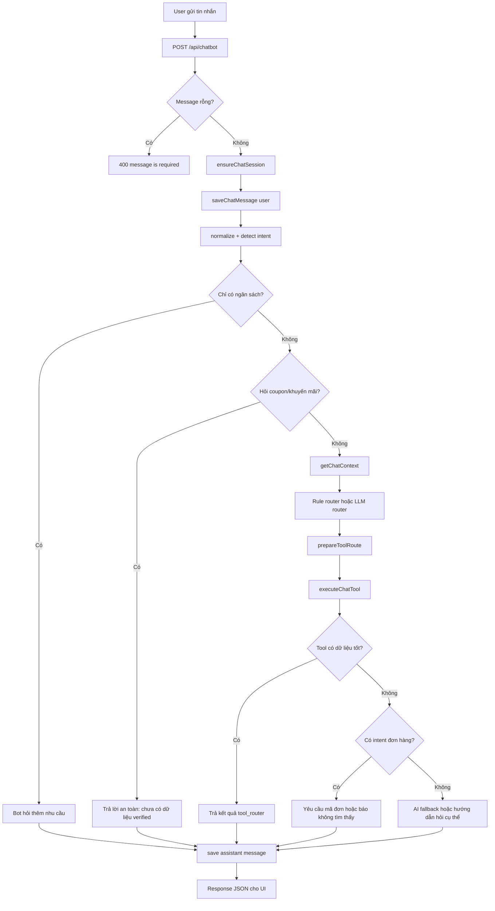

### Các điểm mạnh để trình bày

- Có **session chat**, nên bot nhớ ngữ cảnh hội thoại.
- Có **rule router** cho các tình huống chắc chắn, giảm phụ thuộc AI.
- Có **tool router** để truy vấn dữ liệu thật từ hệ thống.
- Có **AI fallback** khi không có dữ liệu cụ thể.
- Có lưu metadata như source, toolName, confidence, reason để dễ debug.

---

## 13. Sơ đồ tổng hợp luồng mua hàng hoàn chỉnh

```mermaid
flowchart TD
  A[Khách vào website] --> B[Xem danh sách sản phẩm]
  B --> C[GET /api/products]
  C --> D[Chọn sản phẩm]
  D --> E[GET /api/products/[slug]]
  E --> F[Chọn biến thể + số lượng]
  F --> G[POST /api/cart]
  G --> H[GET /api/cart]
  H --> I[Trang checkout]
  I --> J[Nhập thông tin nhận hàng]
  J --> K{Có mã giảm giá?}
  K -- Có --> L[POST /api/checkout/apply-coupon]
  K -- Không --> M[POST /api/checkout]
  L --> M
  M --> N{Phương thức thanh toán}
  N -- Trả tại cửa hàng --> O[Tạo đơn PENDING]
  N -- VNPay --> P[Redirect sang VNPay]
  P --> Q[VNPay redirect /api/payment/vnpay-return]
  Q --> R{Thanh toán thành công?}
  R -- Có --> S[Đơn CONFIRMED + PAID]
  R -- Không --> T[Đơn PENDING + FAILED]
  O --> U[Admin xử lý đơn]
  S --> U
  T --> U
  U --> V[PATCH /api/admin/orders/[id]]
```

---

## 14. Sơ đồ dữ liệu mức khái quát

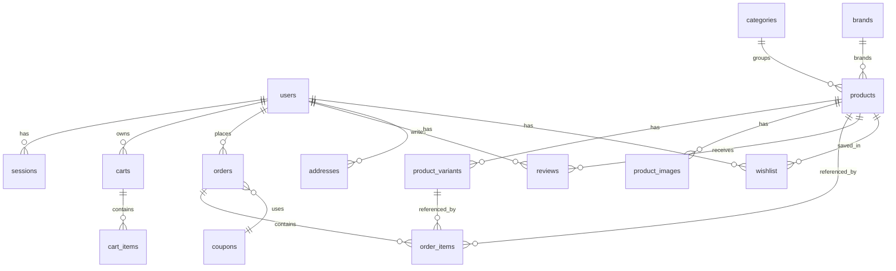

---

## 15. Gợi ý cách trình bày khi bảo vệ

### Câu hỏi: Website xử lý đặt hàng như thế nào?

Trả lời ngắn gọn:

> Khi khách checkout, hệ thống validate thông tin, lấy sản phẩm từ giỏ hàng hoặc request, kiểm tra tồn kho và trạng thái sản phẩm, tính tổng tiền gồm VAT, phí ship, mã giảm giá. Sau đó API mở transaction để tạo order và order_items, cập nhật coupon/cart. Nếu thanh toán online thì tạo URL VNPay, còn nếu nhận tại cửa hàng thì đơn ở trạng thái chờ xử lý.

### Câu hỏi: Làm sao đảm bảo thanh toán VNPay không bị giả mạo?

Trả lời ngắn gọn:

> Endpoint VNPay return luôn verify chữ ký từ query params. Nếu chữ ký sai thì redirect thất bại. Sau đó hệ thống kiểm tra mã đơn, phương thức thanh toán và số tiền trả về có khớp với tổng đơn không, rồi mới cập nhật payment_status thành PAID.

### Câu hỏi: Vì sao dùng session cookie thay vì localStorage?

Trả lời ngắn gọn:

> Cookie session do server tạo và kiểm tra, client không tự quyết định user id. Nhờ vậy API như giỏ hàng, địa chỉ, đơn hàng đều lấy user từ session, tránh việc người dùng sửa localStorage để truy cập dữ liệu người khác.

### Câu hỏi: Chatbot có phải chỉ gọi AI không?

Trả lời ngắn gọn:

> Không. Chatbot dùng kết hợp rule router, tool router và AI fallback. Những câu hỏi liên quan dữ liệu thật như sản phẩm, tồn kho, đơn hàng sẽ ưu tiên tool để lấy dữ liệu từ hệ thống. AI chỉ fallback khi câu hỏi không có dữ liệu cụ thể.

### Câu hỏi: Admin cập nhật sản phẩm ảnh như thế nào?

Trả lời ngắn gọn:

> Khi admin lưu sản phẩm, API chuẩn hóa danh sách ảnh, chọn thumbnail nếu chưa có, update bảng products, xóa ảnh general cũ rồi insert lại danh sách ảnh mới. Điều này giúp dữ liệu ảnh đồng bộ với form admin.

---

## 16. Checklist các điểm nên nhớ

- Auth dùng `session_token` cookie.
- API user/cart/order không tin user id từ client, mà lấy qua session.
- Checkout dùng transaction để tránh tạo đơn nửa chừng.
- VNPay return verify chữ ký và kiểm tra số tiền.
- Cart giới hạn số lượng theo tồn kho product hoặc variant.
- Admin route được middleware bảo vệ.
- Chatbot có session, context, rule router, tool router và AI fallback.
- Product detail hỗ trợ ảnh, variants, specs, reviews.
- Order gồm `orders` và nhiều `order_items`.
- Coupon được kiểm tra active, hạn dùng, usage limit trước khi áp dụng.
