# Flow nghiệp vụ theo chuỗi UI → API → xử lý → DB → response → UI

> Mục tiêu: giúp học cách trình bày từng chức năng theo đúng chuỗi xử lý kỹ thuật nhưng diễn giải bằng ngôn ngữ nghiệp vụ dễ hiểu khi bảo vệ đồ án.

## Cách đọc tài liệu này

Mỗi flow đều bám theo 6 bước cố định:

```text
UI → API → xử lý → DB → response → UI
```

Ý nghĩa:

| Bước | Cách hiểu khi bảo vệ |
|---|---|
| UI | Người dùng thao tác gì trên giao diện |
| API | Frontend gọi endpoint nào |
| Xử lý | Backend kiểm tra, tính toán, validate nghiệp vụ gì |
| DB | Backend đọc/ghi bảng dữ liệu nào |
| Response | API trả kết quả gì cho frontend |
| UI | Giao diện phản hồi lại cho người dùng như thế nào |

> Khi thuyết trình, không cần đọc tên hàm/code quá nhiều. Hãy giải thích theo nghiệp vụ: người dùng làm gì, hệ thống kiểm tra gì, dữ liệu thay đổi ở đâu, kết quả hiển thị ra sao.

---

## 1. Flow đăng nhập

### Chuỗi xử lý

| Bước | Nội dung |
|---|---|
| UI | Người dùng nhập email và mật khẩu ở form đăng nhập |
| API | UI gọi `POST /api/auth/login` |
| Xử lý | API kiểm tra thiếu email/password, tìm user, kiểm tra tài khoản active, xác thực mật khẩu |
| DB | Đọc bảng `users`, ghi session vào bảng/session storage liên quan |
| Response | Trả `success: true`, thông tin user và set cookie `session_token` |
| UI | Lưu trạng thái đã đăng nhập, chuyển người dùng vào trang phù hợp |

### Sơ đồ ngắn

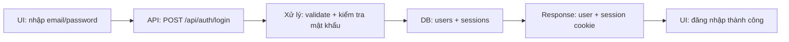

### Cách giải thích nghiệp vụ

> Khi khách hàng đăng nhập, hệ thống không tin trực tiếp dữ liệu từ giao diện. Backend sẽ kiểm tra email, mật khẩu, trạng thái tài khoản rồi mới tạo phiên đăng nhập. Phiên này được lưu bằng cookie `session_token`, giúp các API sau biết người dùng là ai mà không cần frontend gửi user id thủ công.

---

## 2. Flow đăng xuất

### Chuỗi xử lý

| Bước | Nội dung |
|---|---|
| UI | Người dùng bấm nút đăng xuất |
| API | UI gọi `POST /api/auth/logout` |
| Xử lý | API xóa hoặc vô hiệu hóa session hiện tại, xóa cookie |
| DB | Có thể xóa/cập nhật session tương ứng |
| Response | Trả kết quả đăng xuất thành công |
| UI | Xóa trạng thái user, chuyển về trang đăng nhập/trang chủ |

### Sơ đồ ngắn

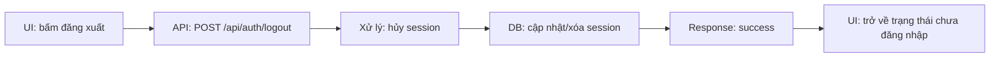

### Cách giải thích nghiệp vụ

> Đăng xuất nghĩa là hệ thống kết thúc phiên làm việc hiện tại. Sau khi cookie bị xóa, người dùng không thể tiếp tục truy cập các chức năng yêu cầu đăng nhập như giỏ hàng cá nhân, đơn hàng hoặc trang admin.

---

## 3. Flow bảo vệ trang admin

### Chuỗi xử lý

| Bước | Nội dung |
|---|---|
| UI | Admin truy cập một trang trong `/admin` |
| API/Middleware | Middleware chạy trước khi vào trang |
| Xử lý | Kiểm tra request có cookie `session_token` hay không |
| DB | Middleware hiện kiểm tra sự tồn tại cookie; các API admin tiếp tục xử lý dữ liệu phía sau |
| Response | Nếu thiếu cookie thì redirect về `/admin/login` |
| UI | Admin hoặc được vào dashboard, hoặc bị yêu cầu đăng nhập |

### Sơ đồ ngắn

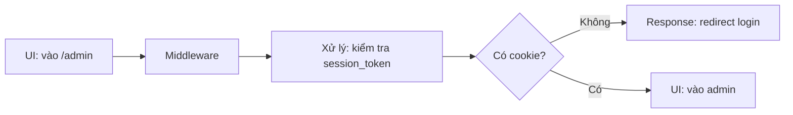

### Cách giải thích nghiệp vụ

> Khu vực admin là vùng quản trị nhạy cảm, nên trước khi hiển thị trang, hệ thống kiểm tra phiên đăng nhập. Nếu chưa có phiên hợp lệ, admin sẽ bị chuyển về trang đăng nhập, tránh truy cập trực tiếp bằng URL.

---

## 4. Flow xem danh sách sản phẩm

### Chuỗi xử lý

| Bước | Nội dung |
|---|---|
| UI | Người dùng mở trang sản phẩm, chọn bộ lọc hoặc sắp xếp |
| API | UI gọi `GET /api/products` kèm query filter/sort |
| Xử lý | API đọc query, chuẩn hóa điều kiện lọc, phân trang/sắp xếp nếu có |
| DB | Đọc bảng `products`, có thể join `categories`, `brands` |
| Response | Trả danh sách sản phẩm, giá, ảnh, trạng thái còn hàng |
| UI | Hiển thị sản phẩm dạng grid/list theo bộ lọc hiện tại |

### Sơ đồ ngắn

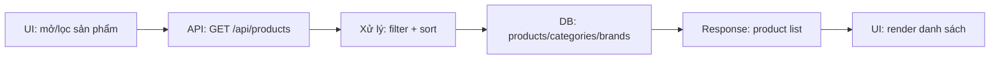

### Cách giải thích nghiệp vụ

> Khi khách hàng lọc sản phẩm, frontend chỉ gửi tiêu chí như danh mục, thương hiệu, mức giá. Backend chịu trách nhiệm lấy đúng dữ liệu từ database và trả về danh sách phù hợp để giao diện hiển thị.

---

## 5. Flow xem chi tiết sản phẩm

### Chuỗi xử lý

| Bước | Nội dung |
|---|---|
| UI | Người dùng click vào một sản phẩm |
| API | UI gọi `GET /api/products/[slug]` |
| Xử lý | API tìm sản phẩm theo slug, gom thông tin liên quan |
| DB | Đọc `products`, `product_variants`, `product_images`, `categories`, `brands` |
| Response | Trả chi tiết sản phẩm, ảnh, biến thể, thông số |
| UI | Hiển thị gallery ảnh, giá, biến thể, tồn kho, nút thêm giỏ hàng |

### Sơ đồ ngắn

```mermaid
flowchart LR
  A[UI: click sản phẩm] --> B[API: GET /api/products/[slug]]
  B --> C[Xử lý: tìm chi tiết theo slug]
  C --> D[DB: product + variants + images]
  D --> E[Response: product detail]
  E --> F[UI: hiển thị chi tiết]
```

### Cách giải thích nghiệp vụ

> Trang chi tiết không chỉ lấy tên và giá sản phẩm, mà còn lấy ảnh, biến thể, thương hiệu và thông số. Nhờ vậy khách hàng có đủ thông tin để quyết định chọn phiên bản và thêm vào giỏ hàng.

---

## 6. Flow thêm sản phẩm vào giỏ hàng

### Chuỗi xử lý

| Bước | Nội dung |
|---|---|
| UI | Người dùng chọn biến thể/số lượng và bấm thêm giỏ hàng |
| API | UI gọi `POST /api/cart` |
| Xử lý | API kiểm tra đăng nhập, kiểm tra sản phẩm active, biến thể hợp lệ, giới hạn số lượng theo tồn kho |
| DB | Đọc `products`, `product_variants`; ghi/cập nhật `carts`, `cart_items` |
| Response | Trả `success`, id item, số lượng thực tế được thêm |
| UI | Cập nhật mini cart/cart count hoặc thông báo thêm thành công |

### Sơ đồ ngắn

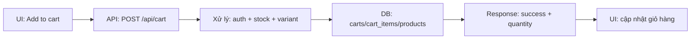

### Cách giải thích nghiệp vụ

> Khi khách thêm sản phẩm, hệ thống không thêm mù quáng. Backend kiểm tra sản phẩm còn bán không, biến thể có hợp lệ không và số lượng có vượt tồn kho không. Nếu sản phẩm đã có trong giỏ, hệ thống cộng dồn số lượng thay vì tạo dòng trùng lặp.

---

## 7. Flow xem giỏ hàng

### Chuỗi xử lý

| Bước | Nội dung |
|---|---|
| UI | Người dùng mở trang giỏ hàng |
| API | UI gọi `GET /api/cart` |
| Xử lý | API lấy user từ session, gom các item trong cart, tính trạng thái còn hàng |
| DB | Đọc `carts`, `cart_items`, `products`, `product_variants` |
| Response | Trả danh sách item trong giỏ, giá, số lượng, `in_stock` |
| UI | Hiển thị giỏ hàng, tổng tạm tính, cảnh báo item hết hàng nếu có |

### Sơ đồ ngắn

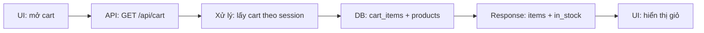

### Cách giải thích nghiệp vụ

> Giỏ hàng gắn với tài khoản đăng nhập. Khi mở giỏ, hệ thống lấy dữ liệu mới nhất từ database, đồng thời kiểm tra lại tồn kho để tránh trường hợp khách đặt sản phẩm đã hết hàng.

---

## 8. Flow cập nhật số lượng hoặc xóa item giỏ hàng

### Chuỗi xử lý

| Bước | Nội dung |
|---|---|
| UI | Người dùng tăng/giảm số lượng hoặc xóa sản phẩm khỏi giỏ |
| API | UI gọi `PATCH /api/cart/item` hoặc `DELETE /api/cart/item` |
| Xử lý | API kiểm tra session, xác định item thuộc cart của user, validate số lượng |
| DB | Cập nhật hoặc xóa dòng trong `cart_items`, cập nhật `carts.updated_at` |
| Response | Trả kết quả thành công hoặc lỗi nếu item không hợp lệ |
| UI | Cập nhật lại số lượng, tổng tiền, hoặc xóa item khỏi màn hình |

### Sơ đồ ngắn

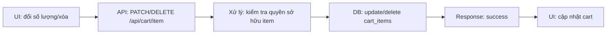

### Cách giải thích nghiệp vụ

> Mỗi thao tác trong giỏ hàng đều được kiểm tra theo tài khoản hiện tại. Điều này đảm bảo người dùng chỉ sửa được sản phẩm trong giỏ hàng của chính họ.

---

## 9. Flow áp mã giảm giá

### Chuỗi xử lý

| Bước | Nội dung |
|---|---|
| UI | Người dùng nhập mã giảm giá ở trang checkout |
| API | UI gọi `POST /api/checkout/apply-coupon` |
| Xử lý | API kiểm tra mã có tồn tại, đang active, chưa hết hạn, còn lượt dùng, đạt giá trị đơn tối thiểu |
| DB | Đọc bảng `coupons` |
| Response | Trả số tiền giảm hoặc thông báo lỗi |
| UI | Cập nhật tổng tiền, hiển thị giảm giá hoặc lỗi mã không hợp lệ |

### Sơ đồ ngắn

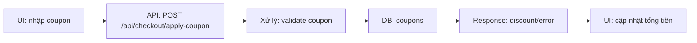

### Cách giải thích nghiệp vụ

> Mã giảm giá không chỉ kiểm tra có tồn tại hay không, mà còn kiểm tra thời hạn, trạng thái kích hoạt, giới hạn lượt dùng và điều kiện đơn tối thiểu. Nhờ đó hệ thống tránh áp sai khuyến mãi.

---

## 10. Flow checkout tạo đơn hàng

### Chuỗi xử lý

| Bước | Nội dung |
|---|---|
| UI | Người dùng nhập thông tin nhận hàng và bấm đặt hàng |
| API | UI gọi `POST /api/checkout` |
| Xử lý | API validate thông tin liên hệ/địa chỉ, lấy item, kiểm tra tồn kho, tính VAT, phí ship, giảm giá, tổng tiền |
| DB | Đọc `products`, `product_variants`, `coupons`, `cart_items`; ghi `orders`, `order_items`; cập nhật coupon/cart |
| Response | Trả thông tin order; nếu VNPay thì trả thêm `paymentUrl` |
| UI | Nếu COD/nhận tại cửa hàng thì báo đặt hàng thành công; nếu VNPay thì chuyển sang cổng thanh toán |

### Sơ đồ ngắn

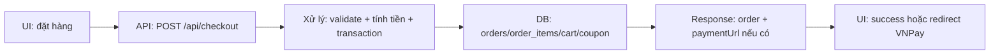

### Cách giải thích nghiệp vụ

> Checkout là bước quan trọng nhất. Hệ thống kiểm tra thông tin khách, kiểm tra lại tồn kho, tính đầy đủ phí ship, VAT và giảm giá. Sau đó backend tạo đơn hàng trong transaction để đảm bảo dữ liệu nhất quán: hoặc tạo đủ order và order items, hoặc nếu lỗi thì rollback không tạo đơn nửa chừng.

---

## 11. Flow thanh toán VNPay trả về

### Chuỗi xử lý

| Bước | Nội dung |
|---|---|
| UI | Người dùng thanh toán trên VNPay và được redirect về website |
| API | VNPay gọi `GET /api/payment/vnpay-return` kèm query |
| Xử lý | API verify chữ ký, lấy mã đơn, kiểm tra phương thức thanh toán, trạng thái giao dịch và số tiền |
| DB | Đọc/cập nhật bảng `orders` |
| Response | Redirect đến `/payment/success` hoặc `/payment/failed` |
| UI | Hiển thị kết quả thanh toán thành công hoặc thất bại |

### Sơ đồ ngắn

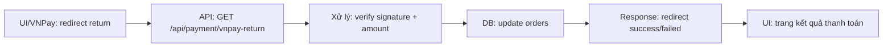

### Cách giải thích nghiệp vụ

> Sau thanh toán, hệ thống không tự động tin kết quả trả về. Backend xác thực chữ ký VNPay, kiểm tra đúng mã đơn và đúng số tiền. Chỉ khi mọi điều kiện hợp lệ, đơn mới được chuyển sang đã thanh toán và xác nhận.

---

## 12. Flow xem đơn hàng cá nhân

### Chuỗi xử lý

| Bước | Nội dung |
|---|---|
| UI | Người dùng vào trang tài khoản/đơn hàng của tôi |
| API | UI gọi `GET /api/me/orders` hoặc `GET /api/me/orders/[id]` |
| Xử lý | API lấy user từ session, chỉ truy vấn đơn thuộc user đó |
| DB | Đọc `orders`, `order_items`, `products`, `product_variants` |
| Response | Trả danh sách đơn hoặc chi tiết đơn |
| UI | Hiển thị lịch sử mua hàng, trạng thái đơn, chi tiết sản phẩm |

### Sơ đồ ngắn

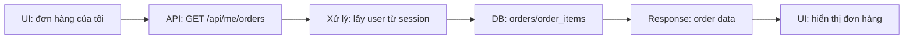

### Cách giải thích nghiệp vụ

> Mỗi khách hàng chỉ xem được đơn hàng của chính mình vì backend lấy user từ session. Frontend không được tự truyền user id để tránh xem nhầm hoặc truy cập dữ liệu người khác.

---

## 13. Flow quản trị cập nhật trạng thái đơn hàng

### Chuỗi xử lý

| Bước | Nội dung |
|---|---|
| UI | Admin mở chi tiết đơn và đổi trạng thái |
| API | UI gọi `PATCH /api/admin/orders/[id]` |
| Xử lý | API nhận `status` và/hoặc `payment_status`, cập nhật đơn tương ứng |
| DB | Cập nhật bảng `orders` |
| Response | Trả order sau khi cập nhật |
| UI | Hiển thị trạng thái mới cho admin |

### Sơ đồ ngắn

```mermaid
flowchart LR
  A[UI Admin: đổi trạng thái] --> B[API: PATCH /api/admin/orders/[id]]
  B --> C[Xử lý: chuẩn hóa status]
  C --> D[DB: update orders]
  D --> E[Response: updated order]
  E --> F[UI Admin: trạng thái mới]
```

### Cách giải thích nghiệp vụ

> Sau khi khách đặt hàng, admin là người vận hành đơn: xác nhận, xử lý, giao hàng hoặc cập nhật thanh toán. API cập nhật trạng thái trong bảng orders để cả admin và khách hàng đều nhìn thấy tiến trình mới nhất.

---

## 14. Flow quản trị sửa sản phẩm

### Chuỗi xử lý

| Bước | Nội dung |
|---|---|
| UI | Admin mở form sửa sản phẩm, thay đổi thông tin/ảnh/giá/tồn kho |
| API | UI gọi `PUT /api/admin/products/[id]` |
| Xử lý | API chuẩn hóa dữ liệu, chọn thumbnail mặc định nếu thiếu, chuẩn hóa specs/images |
| DB | Update `products`, xóa và insert lại ảnh general trong `product_images` |
| Response | Trả product đã cập nhật |
| UI | Form hiển thị dữ liệu mới hoặc quay lại danh sách sản phẩm |

### Sơ đồ ngắn

```mermaid
flowchart LR
  A[UI Admin: lưu sản phẩm] --> B[API: PUT /api/admin/products/[id]]
  B --> C[Xử lý: normalize product/images]
  C --> D[DB: products + product_images]
  D --> E[Response: updated product]
  E --> F[UI Admin: cập nhật thành công]
```

### Cách giải thích nghiệp vụ

> Khi admin sửa sản phẩm, backend đảm bảo dữ liệu được chuẩn hóa trước khi lưu. Đặc biệt phần ảnh được đồng bộ lại: ảnh cũ dạng general bị xóa và danh sách ảnh mới được insert lại để dữ liệu khớp chính xác với form quản trị.

---

## 15. Flow upload ảnh admin

### Chuỗi xử lý

| Bước | Nội dung |
|---|---|
| UI | Admin chọn file ảnh trong form sản phẩm |
| API | UI gọi `POST /api/admin/upload` |
| Xử lý | API kiểm tra file, upload lên dịch vụ lưu trữ ảnh |
| DB | Thường chưa ghi DB ngay; URL ảnh sẽ được lưu khi admin lưu sản phẩm |
| Response | Trả URL ảnh đã upload |
| UI | Hiển thị preview ảnh và đưa URL vào form |

### Sơ đồ ngắn

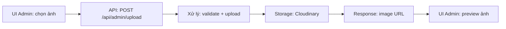

### Cách giải thích nghiệp vụ

> Upload ảnh được tách thành một bước riêng. Khi admin chọn ảnh, hệ thống upload trước để lấy URL. URL này được gắn vào form và chỉ chính thức lưu vào sản phẩm khi admin bấm lưu sản phẩm.

---

## 16. Flow wishlist

### Chuỗi xử lý

| Bước | Nội dung |
|---|---|
| UI | Người dùng bấm trái tim yêu thích sản phẩm |
| API | UI gọi `POST /api/me/wishlist` hoặc `DELETE /api/me/wishlist` |
| Xử lý | API lấy user từ session, kiểm tra product, thêm hoặc xóa wishlist |
| DB | Đọc `products`, ghi/xóa bảng `wishlist` |
| Response | Trả kết quả thành công |
| UI | Đổi trạng thái icon yêu thích, cập nhật danh sách yêu thích |

### Sơ đồ ngắn

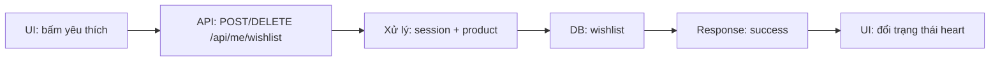

### Cách giải thích nghiệp vụ

> Wishlist giúp khách lưu lại sản phẩm quan tâm. Vì wishlist gắn với tài khoản, backend luôn lấy user từ session để đảm bảo danh sách yêu thích là riêng của từng người.

---

## 17. Flow quản lý địa chỉ người dùng

### Chuỗi xử lý

| Bước | Nội dung |
|---|---|
| UI | Người dùng thêm/sửa/xóa địa chỉ trong tài khoản |
| API | UI gọi `GET/POST/PATCH/DELETE /api/me/addresses` |
| Xử lý | API validate thông tin địa chỉ, kiểm tra địa chỉ thuộc user hiện tại |
| DB | Đọc/ghi/cập nhật/xóa bảng `addresses` |
| Response | Trả danh sách hoặc địa chỉ đã cập nhật |
| UI | Hiển thị địa chỉ mới, dùng cho checkout nếu cần |

### Sơ đồ ngắn

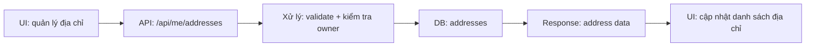

### Cách giải thích nghiệp vụ

> Địa chỉ là dữ liệu cá nhân nên mọi thao tác đều dựa trên session. Người dùng chỉ có thể thêm, sửa, xóa địa chỉ của chính mình và có thể dùng lại địa chỉ đó khi thanh toán.

---

## 18. Flow đánh giá sản phẩm

### Chuỗi xử lý

| Bước | Nội dung |
|---|---|
| UI | Người dùng xem review hoặc gửi đánh giá sau khi mua hàng |
| API | UI gọi `GET /api/products/[slug]/reviews` hoặc `POST /api/me/orders/[id]/reviews` |
| Xử lý | API kiểm tra user, kiểm tra đơn hàng thuộc user, kiểm tra sản phẩm nằm trong đơn |
| DB | Đọc/ghi bảng `reviews`, `orders`, `order_items`, `products` |
| Response | Trả danh sách review hoặc kết quả gửi đánh giá |
| UI | Hiển thị review mới hoặc thông báo gửi thành công |

### Sơ đồ ngắn

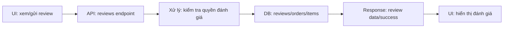

### Cách giải thích nghiệp vụ

> Đánh giá sản phẩm nên gắn với đơn hàng thật. Vì vậy hệ thống kiểm tra người dùng đã mua sản phẩm trong đơn hàng của mình hay chưa trước khi cho gửi đánh giá, giúp review đáng tin cậy hơn.

---

## 19. Flow chatbot hỏi đáp

### Chuỗi xử lý

| Bước | Nội dung |
|---|---|
| UI | Người dùng nhập câu hỏi trong chatbot |
| API | UI gọi `POST /api/chatbot` |
| Xử lý | API tạo/lấy session chat, lưu tin nhắn, phân loại intent bằng rule/router, gọi tool hoặc AI fallback |
| DB | Lưu/lấy lịch sử chat; tool có thể đọc products/orders tùy câu hỏi |
| Response | Trả `reply`, `source`, `toolName`, `data` nếu có |
| UI | Hiển thị câu trả lời và giữ mạch hội thoại |

### Sơ đồ ngắn

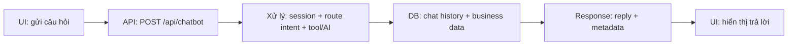

### Cách giải thích nghiệp vụ

> Chatbot không chỉ trả lời bằng AI. Hệ thống ưu tiên hiểu intent, gọi tool để lấy dữ liệu thật như sản phẩm, tồn kho hoặc đơn hàng. Nếu không có dữ liệu phù hợp thì mới dùng AI fallback, nhờ vậy câu trả lời vừa linh hoạt vừa hạn chế sai lệch.

---

## 20. Flow kiểm tra trạng thái đơn qua chatbot

### Chuỗi xử lý

| Bước | Nội dung |
|---|---|
| UI | Người dùng hỏi chatbot về mã đơn hàng |
| API | UI gọi `POST /api/chatbot` |
| Xử lý | Chatbot nhận diện intent kiểm tra đơn, trích mã đơn, route sang tool `checkOrderStatus` |
| DB | Tool đọc bảng `orders` và dữ liệu liên quan |
| Response | Trả trạng thái đơn hoặc yêu cầu nhập lại mã đơn |
| UI | Chatbot hiển thị tình trạng đơn cho khách |

### Sơ đồ ngắn

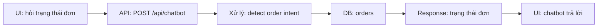

### Cách giải thích nghiệp vụ

> Khi khách hỏi về đơn hàng, chatbot cố gắng nhận diện mã đơn trong câu hỏi. Nếu có mã đơn, hệ thống tra dữ liệu thật trong bảng orders để trả trạng thái. Nếu thiếu mã, bot sẽ hỏi lại thay vì đoán.

---

## 21. Flow đăng ký tài khoản

### Chuỗi xử lý

| Bước | Nội dung |
|---|---|
| UI | Người dùng nhập thông tin đăng ký |
| API | UI gọi `POST /api/auth/register` |
| Xử lý | API validate dữ liệu, kiểm tra email đã tồn tại chưa, hash mật khẩu |
| DB | Đọc/ghi bảng `users` |
| Response | Trả kết quả tạo tài khoản thành công hoặc lỗi email trùng |
| UI | Thông báo đăng ký thành công, chuyển sang đăng nhập hoặc tự đăng nhập tùy thiết kế |

### Sơ đồ ngắn

```mermaid
flowchart LR
  A[UI: form đăng ký] --> B[API: POST /api/auth/register]
  B --> C[Xử lý: validate + hash password]
  C --> D[DB: users]
  D --> E[Response: success/error]
  E --> F[UI: thông báo kết quả]
```

### Cách giải thích nghiệp vụ

> Đăng ký tài khoản là bước tạo hồ sơ khách hàng. Backend kiểm tra email không bị trùng và mật khẩu được hash trước khi lưu, giúp không lưu mật khẩu gốc trong database.

---

## 22. Flow quản trị coupon

### Chuỗi xử lý

| Bước | Nội dung |
|---|---|
| UI | Admin tạo hoặc xem danh sách mã giảm giá |
| API | UI gọi `GET/POST /api/admin/coupons` |
| Xử lý | API lấy danh sách coupon hoặc validate dữ liệu coupon mới |
| DB | Đọc/ghi bảng `coupons` |
| Response | Trả danh sách hoặc coupon vừa tạo |
| UI | Hiển thị mã giảm giá trong trang admin |

### Sơ đồ ngắn

```mermaid
flowchart LR
  A[UI Admin: quản lý coupon] --> B[API: /api/admin/coupons]
  B --> C[Xử lý: validate coupon]
  C --> D[DB: coupons]
  D --> E[Response: coupon data]
  E --> F[UI Admin: cập nhật danh sách]
```

### Cách giải thích nghiệp vụ

> Coupon do admin cấu hình trước, gồm loại giảm giá, giá trị, điều kiện tối thiểu, giới hạn lượt dùng và hạn sử dụng. Khi checkout, hệ thống dựa trên dữ liệu này để quyết định có áp mã hay không.

---

## 23. Công thức nói nhanh cho mọi flow

Khi bị hỏi bất kỳ flow nào, có thể trả lời theo mẫu:

```text
Người dùng thao tác ở UI → frontend gọi API tương ứng → backend validate nghiệp vụ
→ đọc/ghi database → API trả kết quả → UI cập nhật lại màn hình cho người dùng.
```

Ví dụ với giỏ hàng:

> Người dùng bấm thêm giỏ hàng ở UI, frontend gọi API cart. Backend kiểm tra đăng nhập, kiểm tra sản phẩm và tồn kho, sau đó ghi vào cart_items trong database. API trả kết quả thành công và UI cập nhật số lượng trong giỏ hàng.

Ví dụ với thanh toán:

> Người dùng bấm đặt hàng, frontend gọi API checkout. Backend kiểm tra thông tin nhận hàng, kiểm tra sản phẩm, tính tổng tiền và tạo order trong database. Nếu thanh toán online, API trả link VNPay để UI chuyển người dùng sang cổng thanh toán.

---

## 24. Bảng học nhanh theo nghiệp vụ

| Nghiệp vụ | Câu giải thích ngắn |
|---|---|
| Đăng nhập | Xác thực tài khoản và tạo session cookie để nhận diện user |
| Xem sản phẩm | Lấy dữ liệu sản phẩm theo filter để khách dễ tìm hàng |
| Chi tiết sản phẩm | Gom thông tin ảnh, biến thể, thông số để khách ra quyết định |
| Giỏ hàng | Lưu sản phẩm khách định mua và kiểm tra tồn kho liên tục |
| Coupon | Kiểm tra điều kiện khuyến mãi trước khi giảm tiền |
| Checkout | Chốt đơn, tính tiền và lưu order/order_items an toàn bằng transaction |
| VNPay | Xác thực kết quả thanh toán trước khi cập nhật đơn đã thanh toán |
| Admin order | Cho nhân viên vận hành cập nhật tiến trình xử lý đơn |
| Admin product | Cho admin quản lý dữ liệu bán hàng như ảnh, giá, tồn kho |
| Chatbot | Hỗ trợ khách bằng dữ liệu thật trước, AI fallback sau |

---

## 25. Checklist khi ôn bảo vệ

- Với mỗi flow, luôn nói đủ 6 bước: UI, API, xử lý, DB, response, UI.
- Ưu tiên ngôn ngữ nghiệp vụ, hạn chế đọc code.
- Nhấn mạnh backend luôn validate lại dữ liệu, không tin hoàn toàn frontend.
- Các dữ liệu cá nhân như cart, order, address, wishlist đều dựa trên session.
- Checkout dùng transaction để đảm bảo dữ liệu nhất quán.
- Thanh toán online phải verify chữ ký và số tiền.
- Chatbot ưu tiên dữ liệu thật qua tool, không phụ thuộc hoàn toàn AI.
