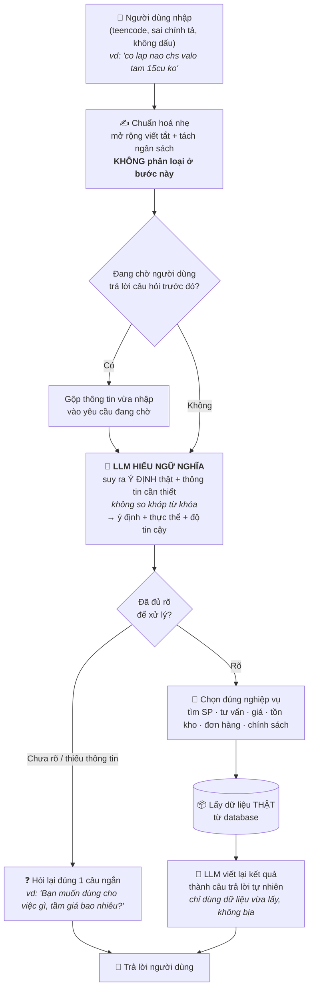

# Luồng xử lý input của Chatbot

> Trọng tâm: **input được xử lý như thế nào**, và vì sao LLM **hiểu ý người dùng theo ngữ nghĩa**
> thay vì dò từ khóa cứng. (Không đi sâu vào tầng kỹ thuật bên trong.)

## Sơ đồ luồng

## Điểm mấu chốt: LLM hiểu ngữ nghĩa, KHÔNG dựa keyword

| | Cách dò từ khóa (cũ) | Cách LLM hiểu ngữ nghĩa (đang dùng) |
|---|---|---|
| Nguyên lý | Câu có chứa chữ "game" → gaming | Hiểu **ý định thật** của cả câu |
| Ví dụ input | `"chs valo"` | `"chs valo"` |
| Kết quả | ❌ Không có chữ "game" → bỏ sót | ✅ Hiểu = "chơi Valorant" = nhu cầu **gaming** |
| Input bẩn | Sai chính tả / teencode → trượt | ✅ Vẫn hiểu đúng ý |

→ Việc "chuẩn hoá" ở bước đầu **chỉ là dọn dẹp nhẹ** (mở rộng viết tắt, đọc ra số tiền),
**không phải** nơi quyết định ý định. Toàn bộ việc *hiểu người dùng muốn gì* do **LLM đảm nhận bằng suy luận ngữ nghĩa**.

## Diễn giải 6 bước (ngắn gọn)

1. **Nhập** — người dùng gõ tự nhiên, có thể sai chính tả, viết tắt, không dấu.
2. **Chuẩn hoá nhẹ** — mở rộng vài từ viết tắt và tách ngân sách cho dễ đọc; chưa phân loại gì.
3. **Kiểm tra ngữ cảnh** — nếu bot vừa hỏi lại, thì câu này được hiểu là phần trả lời và gộp vào yêu cầu cũ.
4. **LLM hiểu ý định** — đọc cả câu + ngữ cảnh, suy ra *người dùng thực sự muốn gì* và *thông tin kèm theo* (loại máy, nhu cầu, ngân sách, tên sản phẩm…).
5. **Quyết định** — đủ rõ thì chọn đúng nghiệp vụ và lấy dữ liệu thật; chưa rõ thì hỏi lại đúng một câu.
6. **Trả lời** — LLM viết kết quả thành câu tự nhiên, chỉ dựa trên dữ liệu lấy được.
